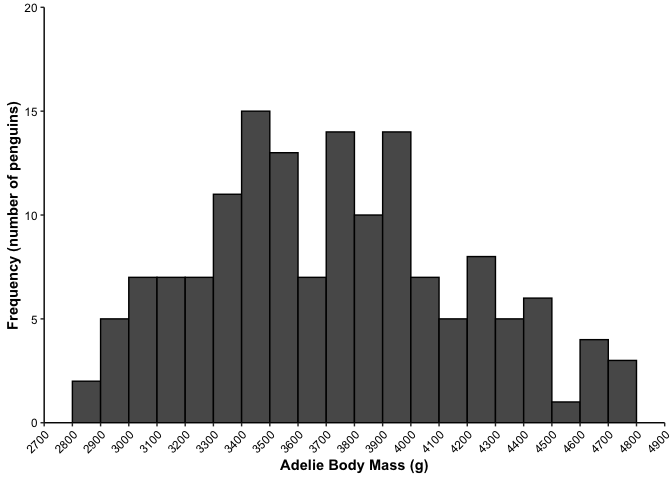
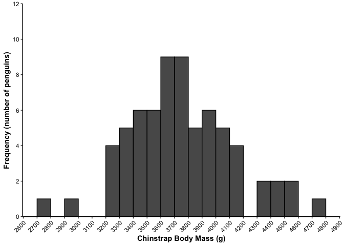
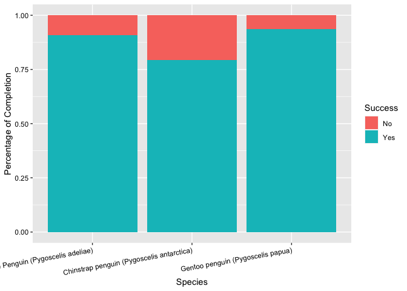

-----

## output: github\_document

# A Correlational Study of Penguin Mass and Clutch Completion

Nathan Snell

Biosciences Department, Minnesota State University Moorhead, 1104 7th
Avenue South, Moorhead, MN 56563 USA

## Abstract

The Palmer Long-Term Ecological Research (LTER) study area is an area
west of Antarctica. It is one of the three existing research facilities
that the United States has to analyze Antarctic marine ecosystems. One
of the organisms investigated by the biologists in this facility is the
penguin. Observations of the Chinstrap, Adélie, and Gentoo penguins have
been recorded on three islands with various measurements in the size,
length, region, sex, stage, etc. The health of penguins is often
determined by their size and if they can reproduce efficiently. It is
for this reason that I want to determine if there is a significant
difference in the size of the penguin species and if they have full
clutch sizes. I will use exploratory data analysis to determine this. I
plan to compare each species of penguins and the percentage at which
they completed their clutch. With this data analysis, I intend to draw
conclusions if there is a correlation between species of the penguins
and how well they can produce a full clutch size.

## Introduction

The Palmer Long-Term Ecological Research (LTER) study area is an area
west of Antarctica. It is one of the three existing research facilities
that the United States has in order to analyze Antarctic marine
ecosystems. These Antarctic marine ecosystems include sea ice habitats,
oceanography, and bird nesting sites. One of the bird species that have
been examined were the antarctic penguins found on three islands. The
three species of penguins that were examined were the Adelie, Gentoo,
and Chinstrap penguins which make up over half of the avian life in
Antarctica (Ancel, 2013). These penguins all occupy the islands of
Antarctica and tend to stay on one island for the entire year where they
hunt and breed. Chinstrap and Adelie penguins have similar weights and
statures at roughly 10 pounds and 2 feet tall. However, Gentoo penguins
are the third largest penguins which weigh 17 pounds and stand at 2 and
a half to 3 feet tall. Different statistics of these penguins were taken
for determination of age, size, island, sex, reproduction, and isotope
concentration. Each of these statistics could be pulled from their
website to be analyzed. Of the most interest to most scientists is the
result of how well a species can reproduce. The reproduction success
rate is measured in many different ways as organisms show different
reproduction strategies. Birds employ a strategy of laying eggs then
caring for their young until they can leave the nest. These nests are
known as clutches and vary in size according to the species of bird and
where the bird is located. For the penguins under research, completed
clutch has two eggs in them while an uncompleted clutch would have one
or no eggs in the clutch. The likelihood of a completed clutch is
determined by many variables including climate, food availability, and
competition (Enrich, 1988). One such variable includes the size of the
body mass of the penguin. Research shows that an organism that weighs
more than their counterparts is shown to have a higher probability to
survive and reproduce. This is because the reproductive process is
metabolically taxing and once it is over these organisms have lost their
fat stores. This means that those who have greater fat stores are more
likely to have the energy to find food after reproducing. This improves
the odds of that organism surviving and reproducing again (Hansen,
2013). It is for this reason the variables that will be explored in this
experiment is the species and mass of the penguin. In this experiment, I
will compare each of the penguin species to the percentage of completed
clutches they have. My hypothesis is that there will be no significant
difference between the mass distribution of the penguins and the
percentage of incompleted clutch size. This will be analyzed using
exploratory data analysis.

## Methods and Materials

### Data Aquisition

1.  Data was taken from the Palmer Long Term Ecological Research (LTER)
    study area in Antarctica. These Datasets were downloaded from given
    packages on github (Horst, et al., 2020).

2.  The available datasets packages found on github were uploaded into R
    studio (RStudio Team, 2020)

3.  Associated packages were downloaded to run these datasets in Rstudio
    (Wickham, 2020) (Wickham et al., 2021).

### Data Preparation

1.  The Palmar Penguins datasets was converted into a table and run so
    all the observations and variables were present. The dataset known
    as “penguins\_raw” was then used for the remainder of the
    experiment.

2.  The table’s labels were then renamed so that the dataset could be
    used to create graphs and charts without hassle.

3.  The body masses of each species was compared for each. island. This
    was done by graphing the body masses of each species compared to the
    individual islands.

4.  The number of penguins for each species was determined by creating a
    bar graph.

5.  The number of completed clutches and uncompleted clutches were
    examined for each species. This was done by creating a stacked bar
    graph.

6.  Body masses of each species were individually analyzed by the
    frequency of their occurrence.

## Results

The results show that all three penguin species have a distribution that
follows a normal curve. If we look at the clutch completion of each
species, we see that the Gentoo penguin also has the highest proportion
of incomplete clutches compared to the other two penguin species.

    ## # A tibble: 344 x 8
    ##    species island bill_length_mm bill_depth_mm flipper_length_… body_mass_g
    ##    <fct>   <fct>           <dbl>         <dbl>            <int>       <int>
    ##  1 Adelie  Torge…           39.1          18.7              181        3750
    ##  2 Adelie  Torge…           39.5          17.4              186        3800
    ##  3 Adelie  Torge…           40.3          18                195        3250
    ##  4 Adelie  Torge…           NA            NA                 NA          NA
    ##  5 Adelie  Torge…           36.7          19.3              193        3450
    ##  6 Adelie  Torge…           39.3          20.6              190        3650
    ##  7 Adelie  Torge…           38.9          17.8              181        3625
    ##  8 Adelie  Torge…           39.2          19.6              195        4675
    ##  9 Adelie  Torge…           34.1          18.1              193        3475
    ## 10 Adelie  Torge…           42            20.2              190        4250
    ## # … with 334 more rows, and 2 more variables: sex <fct>, year <int>

    ## # A tibble: 344 x 17
    ##    studyName `Sample Number` Species Region Island Stage `Individual ID`
    ##    <chr>               <dbl> <chr>   <chr>  <chr>  <chr> <chr>          
    ##  1 PAL0708                 1 Adelie… Anvers Torge… Adul… N1A1           
    ##  2 PAL0708                 2 Adelie… Anvers Torge… Adul… N1A2           
    ##  3 PAL0708                 3 Adelie… Anvers Torge… Adul… N2A1           
    ##  4 PAL0708                 4 Adelie… Anvers Torge… Adul… N2A2           
    ##  5 PAL0708                 5 Adelie… Anvers Torge… Adul… N3A1           
    ##  6 PAL0708                 6 Adelie… Anvers Torge… Adul… N3A2           
    ##  7 PAL0708                 7 Adelie… Anvers Torge… Adul… N4A1           
    ##  8 PAL0708                 8 Adelie… Anvers Torge… Adul… N4A2           
    ##  9 PAL0708                 9 Adelie… Anvers Torge… Adul… N5A1           
    ## 10 PAL0708                10 Adelie… Anvers Torge… Adul… N5A2           
    ## # … with 334 more rows, and 10 more variables: `Clutch Completion` <chr>, `Date
    ## #   Egg` <date>, `Culmen Length (mm)` <dbl>, `Culmen Depth (mm)` <dbl>,
    ## #   `Flipper Length (mm)` <dbl>, `Body Mass (g)` <dbl>, Sex <chr>, `Delta 15 N
    ## #   (o/oo)` <dbl>, `Delta 13 C (o/oo)` <dbl>, Comments <chr>

    ## # A tibble: 344 x 17
    ##    studyName `Sample Number` Species Region Island Stage `Individual ID`
    ##    <chr>               <dbl> <chr>   <chr>  <chr>  <chr> <chr>          
    ##  1 PAL0708                 1 Adelie… Anvers Torge… Adul… N1A1           
    ##  2 PAL0708                 2 Adelie… Anvers Torge… Adul… N1A2           
    ##  3 PAL0708                 3 Adelie… Anvers Torge… Adul… N2A1           
    ##  4 PAL0708                 4 Adelie… Anvers Torge… Adul… N2A2           
    ##  5 PAL0708                 5 Adelie… Anvers Torge… Adul… N3A1           
    ##  6 PAL0708                 6 Adelie… Anvers Torge… Adul… N3A2           
    ##  7 PAL0708                 7 Adelie… Anvers Torge… Adul… N4A1           
    ##  8 PAL0708                 8 Adelie… Anvers Torge… Adul… N4A2           
    ##  9 PAL0708                 9 Adelie… Anvers Torge… Adul… N5A1           
    ## 10 PAL0708                10 Adelie… Anvers Torge… Adul… N5A2           
    ## # … with 334 more rows, and 10 more variables: `Clutch Completion` <chr>, `Date
    ## #   Egg` <date>, `Culmen Length (mm)` <dbl>, `Culmen Depth (mm)` <dbl>,
    ## #   `Flipper Length (mm)` <dbl>, `Body Mass (g)` <dbl>, Sex <chr>, `Delta 15 N
    ## #   (o/oo)` <dbl>, `Delta 13 C (o/oo)` <dbl>, Comments <chr>

    ##  [1] "studyName"           "Sample Number"       "Species"            
    ##  [4] "Region"              "Island"              "Stage"              
    ##  [7] "Individual ID"       "Clutch Completion"   "Date Egg"           
    ## [10] "Culmen Length (mm)"  "Culmen Depth (mm)"   "Flipper Length (mm)"
    ## [13] "Body Mass (g)"       "Sex"                 "Delta 15 N (o/oo)"  
    ## [16] "Delta 13 C (o/oo)"   "Comments"

    ## # A tibble: 344 x 17
    ##    studyName `Sample Number` species Region Island Stage `Individual ID`
    ##    <chr>               <dbl> <chr>   <chr>  <chr>  <chr> <chr>          
    ##  1 PAL0708                 1 Adelie… Anvers Torge… Adul… N1A1           
    ##  2 PAL0708                 2 Adelie… Anvers Torge… Adul… N1A2           
    ##  3 PAL0708                 3 Adelie… Anvers Torge… Adul… N2A1           
    ##  4 PAL0708                 4 Adelie… Anvers Torge… Adul… N2A2           
    ##  5 PAL0708                 5 Adelie… Anvers Torge… Adul… N3A1           
    ##  6 PAL0708                 6 Adelie… Anvers Torge… Adul… N3A2           
    ##  7 PAL0708                 7 Adelie… Anvers Torge… Adul… N4A1           
    ##  8 PAL0708                 8 Adelie… Anvers Torge… Adul… N4A2           
    ##  9 PAL0708                 9 Adelie… Anvers Torge… Adul… N5A1           
    ## 10 PAL0708                10 Adelie… Anvers Torge… Adul… N5A2           
    ## # … with 334 more rows, and 10 more variables: clutch_completion <chr>, `Date
    ## #   Egg` <date>, `Culmen Length (mm)` <dbl>, `Culmen Depth (mm)` <dbl>,
    ## #   `Flipper Length (mm)` <dbl>, body_mass <dbl>, Sex <chr>, `Delta 15 N
    ## #   (o/oo)` <dbl>, `Delta 13 C (o/oo)` <dbl>, Comments <chr>

    ## # A tibble: 152 x 17
    ##    studyName `Sample Number` species Region Island Stage `Individual ID`
    ##    <chr>               <dbl> <chr>   <chr>  <chr>  <chr> <chr>          
    ##  1 PAL0708                 1 Adelie… Anvers Torge… Adul… N1A1           
    ##  2 PAL0708                 2 Adelie… Anvers Torge… Adul… N1A2           
    ##  3 PAL0708                 3 Adelie… Anvers Torge… Adul… N2A1           
    ##  4 PAL0708                 4 Adelie… Anvers Torge… Adul… N2A2           
    ##  5 PAL0708                 5 Adelie… Anvers Torge… Adul… N3A1           
    ##  6 PAL0708                 6 Adelie… Anvers Torge… Adul… N3A2           
    ##  7 PAL0708                 7 Adelie… Anvers Torge… Adul… N4A1           
    ##  8 PAL0708                 8 Adelie… Anvers Torge… Adul… N4A2           
    ##  9 PAL0708                 9 Adelie… Anvers Torge… Adul… N5A1           
    ## 10 PAL0708                10 Adelie… Anvers Torge… Adul… N5A2           
    ## # … with 142 more rows, and 10 more variables: clutch_completion <chr>, `Date
    ## #   Egg` <date>, `Culmen Length (mm)` <dbl>, `Culmen Depth (mm)` <dbl>,
    ## #   `Flipper Length (mm)` <dbl>, body_mass <dbl>, Sex <chr>, `Delta 15 N
    ## #   (o/oo)` <dbl>, `Delta 13 C (o/oo)` <dbl>, Comments <chr>

    ## # A tibble: 68 x 17
    ##    studyName `Sample Number` species Region Island Stage `Individual ID`
    ##    <chr>               <dbl> <chr>   <chr>  <chr>  <chr> <chr>          
    ##  1 PAL0708                 1 Chinst… Anvers Dream  Adul… N61A1          
    ##  2 PAL0708                 2 Chinst… Anvers Dream  Adul… N61A2          
    ##  3 PAL0708                 3 Chinst… Anvers Dream  Adul… N62A1          
    ##  4 PAL0708                 4 Chinst… Anvers Dream  Adul… N62A2          
    ##  5 PAL0708                 5 Chinst… Anvers Dream  Adul… N64A1          
    ##  6 PAL0708                 6 Chinst… Anvers Dream  Adul… N64A2          
    ##  7 PAL0708                 7 Chinst… Anvers Dream  Adul… N66A1          
    ##  8 PAL0708                 8 Chinst… Anvers Dream  Adul… N66A2          
    ##  9 PAL0708                 9 Chinst… Anvers Dream  Adul… N67A1          
    ## 10 PAL0708                10 Chinst… Anvers Dream  Adul… N67A2          
    ## # … with 58 more rows, and 10 more variables: clutch_completion <chr>, `Date
    ## #   Egg` <date>, `Culmen Length (mm)` <dbl>, `Culmen Depth (mm)` <dbl>,
    ## #   `Flipper Length (mm)` <dbl>, body_mass <dbl>, Sex <chr>, `Delta 15 N
    ## #   (o/oo)` <dbl>, `Delta 13 C (o/oo)` <dbl>, Comments <chr>

    ## # A tibble: 124 x 17
    ##    studyName `Sample Number` species Region Island Stage `Individual ID`
    ##    <chr>               <dbl> <chr>   <chr>  <chr>  <chr> <chr>          
    ##  1 PAL0708                 1 Gentoo… Anvers Biscoe Adul… N31A1          
    ##  2 PAL0708                 2 Gentoo… Anvers Biscoe Adul… N31A2          
    ##  3 PAL0708                 3 Gentoo… Anvers Biscoe Adul… N32A1          
    ##  4 PAL0708                 4 Gentoo… Anvers Biscoe Adul… N32A2          
    ##  5 PAL0708                 5 Gentoo… Anvers Biscoe Adul… N33A1          
    ##  6 PAL0708                 6 Gentoo… Anvers Biscoe Adul… N33A2          
    ##  7 PAL0708                 7 Gentoo… Anvers Biscoe Adul… N34A1          
    ##  8 PAL0708                 8 Gentoo… Anvers Biscoe Adul… N34A2          
    ##  9 PAL0708                 9 Gentoo… Anvers Biscoe Adul… N35A1          
    ## 10 PAL0708                10 Gentoo… Anvers Biscoe Adul… N35A2          
    ## # … with 114 more rows, and 10 more variables: clutch_completion <chr>, `Date
    ## #   Egg` <date>, `Culmen Length (mm)` <dbl>, `Culmen Depth (mm)` <dbl>,
    ## #   `Flipper Length (mm)` <dbl>, body_mass <dbl>, Sex <chr>, `Delta 15 N
    ## #   (o/oo)` <dbl>, `Delta 13 C (o/oo)` <dbl>, Comments <chr>

<!-- --><!-- --><!-- --><!-- --><!-- -->

## Discussion

The results showed the highest proportion of incomplete clutches of all
the penguin species. However, all three of the penguin species showed a
normal distribution with no significant differences in the distribution.
Therefore, there is no correlation between the mass of a penguin and the
completion percentage of a clutch. When research is conducted on the
deviations of body masses in a species, we find that the correlation
between mass and reproduction is inconclusive. A study done on moles
showed that there is a positive correlation to increased body mass and
reproductive success for females. However, there is no correlation in
body mass and reproductive success for males (Boratyński, 2010). This is
because females don’t select males on body mass alone. Therefore, it
should be expected for organisms that the correlation between body mass
and reproductive success is not one dimensional. That means other
factors would have a major impact on the reproductive success of
organisms. I would expand upon this experiment in one of two ways. I
would look at the sex of the penguins and determine if body mass is
correlated to the reproductive success of a male or female penguin. I
would also expand upon this by taking more experiment subjects of each
penguin species on multiple islands and record data on them for 5 years.

## References

Ancel, A., Beaulieu, M., Gilbert, C (2013). The Different Breeding
Strategies of Penguins: A Review. Comptes Rendus Biologies, No Longer
Published by Elsevier
www.sciencedirect.com/science/article/pii/S1631069113000097.

Boratyński, Z., & Koteja, P. (2010). Sexual and natural selection on
body mass and metabolic rates in free-living bank voles. Functional
Ecology, 24(6), 1252-1261. Retrieved April 19, 2021, from
<http://www.jstor.org/stable/40963556>

Ehrlich, P., Dobkin, D., Wheye, D (1988). Variation in Clutch Sizes
web.stanford.edu/group/stanfordbirds/text/essays/Variation\_in\_Clutch.html.

Horst AM, Hill AP, Gorman KB (2020). palmerpenguins: Palmer \#\>
Archipelago (Antarctica) penguin data. R package version 0.1.0. \#\>
<https://allisonhorst.github.io/palmerpenguins/>. doi: \#\>
10.5281/zenodo.3960218.

Hadley Wickham, Romain François, Lionel Henry and Kirill Müller (2021).
dplyr: A Grammar of Data Manipulation. R package version 1.0.3.
<https://CRAN.R-project.org/package=dplyr>

Hansen, M., Flatt, T., Aguilaniu, H (2013). Reproduction, Fat
Metabolism, and Life Span: What Is the Connection? Cell Metabolism. Cell
Press,
<https://www.sciencedirect.com/science/article/pii/S1550413112004949>

H. Wickham. ggplot2: Elegant Graphics for Data Analysis. Springer-Verlag
New York, 2016.

RStudio Team (2020). RStudio: Integrated Development Environment for R.
RStudio, PBC, Boston, MA URL <http://www.rstudio.com/>.
