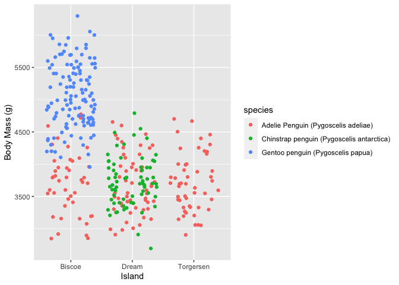

Palmer Penguins
================
Nathan Snell
3/9/2021

## Abstract

The Palmer Long-Term Ecological Research (LTER) study area is an area
west of Antarctica. It is one of the three existing research facilities
that the United States has to analyze Antarctic marine ecosystems. One
of the organisms investigated by the biologists in this facility is the
penguin. Observations of the Chinstrap, Adélie, and Gentoo penguins have
been recorded on three islands with various measurements in the size,
length, region, sex, stage, etc. The health of penguins is often
determined by their size and if they can reproduce efficiently. It is
for this reason that I want to determine if there is a significant
difference in the size of the penguin species and if they have full
clutch sizes. I will use exploratory data analysis to determine this. I
plan to compare each species of penguins and the percentage at which
they completed their clutch. With this data analysis, I intend to draw
conclusions if there is a correlation between species of the penguins
and how well they can produce a full clutch size.

## Introduction

The Palmer Long-Term Ecological Research (LTER) study area is an area
west of Antarctica. It is one of the three existing research facilities
that the United States has in order to analyze Antarctic marine
ecosystems. These Antarctic marine ecosystems include sea ice habitats,
oceanography, and bird nesting sites. One of the birds that were
examined were the antarctic penguins found on three islands. The three
species of penguins that were examined were the Adelie, Gentoo, and
Chinstrap penguins. Different statistics of these penguins were taken
for determination of age, size, island, sex, reproduction, and isotope
concentration. Each of these statistics could be pulled from their
website to be analyzed. Of the most interest to most scientists is the
result of how well a species can reproduce. The reproduction success
rate is measured in many different ways as organisms show different
reproduction strategies. The penguins of this region show the strategy
of completing their clutch. A clutch is a ground nest made by these
penguins. A completed clutch has two eggs in them while an uncompleted
clutch would have one or no eggs in the clutch. The likelihood of a
completed clutch is determined by many variables. However, the variable
that will be explored in this experiment is the species of the penguin.
in this experiment, I will compare each of the penguin species to the
percentage of completed clutches they have. This will be analyzed using
exploratory data analysis.

## Methods and Materials

### Data Aquisition

1.  Data was taken from the Palmer Long Term Ecological Research (LTER)
    study area in Antarctica. These Datasets were downloaded from given
    packages on github (Horst, et al., 2020).

2.  The available datasets packages found on github were uploaded into R
    studio (RStudio Team, 2020)

3.  Associated packages were downloaded to run these datasets in Rstudio
    (Wickham, 2020) (Wickham et al., 2021).

### Data Preparation

1.  The Palmar Penguins datasets was converted into a table and run so
    all the observations and variables were present. The dataset known
    as “penguins\_raw” was then used for the remainder of the
    experiment.

2.  The table’s labels were then renamed so that the dataset could be
    used to create graphs and charts without hassle.

3.  The body masses of each species was compared for each. island. This
    was done by graphing the body masses of each species compared to the
    individual islands.

4.  The number of penguins for each species was determined by creating a
    bar graph.

5.  The number of completed clutches and uncompleted clutches were
    examined for each species. This was done by creating a stacked bar
    graph.

6.  Body masses of each species were individually analyzed by the
    frequency of their occurrence.

## Results

``` r
library(tidyverse)
```

    ## ── Attaching packages ─────────────────────────────────────── tidyverse 1.3.0 ──

    ## ✓ ggplot2 3.3.3     ✓ purrr   0.3.4
    ## ✓ tibble  3.0.5     ✓ dplyr   1.0.3
    ## ✓ tidyr   1.1.2     ✓ stringr 1.4.0
    ## ✓ readr   1.4.0     ✓ forcats 0.5.0

    ## ── Conflicts ────────────────────────────────────────── tidyverse_conflicts() ──
    ## x dplyr::filter() masks stats::filter()
    ## x dplyr::lag()    masks stats::lag()

``` r
library(ggplot2)

library(palmerpenguins)
data(package = 'palmerpenguins')
(penguins)
```

    ## # A tibble: 344 x 8
    ##    species island bill_length_mm bill_depth_mm flipper_length_… body_mass_g
    ##    <fct>   <fct>           <dbl>         <dbl>            <int>       <int>
    ##  1 Adelie  Torge…           39.1          18.7              181        3750
    ##  2 Adelie  Torge…           39.5          17.4              186        3800
    ##  3 Adelie  Torge…           40.3          18                195        3250
    ##  4 Adelie  Torge…           NA            NA                 NA          NA
    ##  5 Adelie  Torge…           36.7          19.3              193        3450
    ##  6 Adelie  Torge…           39.3          20.6              190        3650
    ##  7 Adelie  Torge…           38.9          17.8              181        3625
    ##  8 Adelie  Torge…           39.2          19.6              195        4675
    ##  9 Adelie  Torge…           34.1          18.1              193        3475
    ## 10 Adelie  Torge…           42            20.2              190        4250
    ## # … with 334 more rows, and 2 more variables: sex <fct>, year <int>

``` r
(penguins_raw)
```

    ## # A tibble: 344 x 17
    ##    studyName `Sample Number` Species Region Island Stage `Individual ID`
    ##    <chr>               <dbl> <chr>   <chr>  <chr>  <chr> <chr>          
    ##  1 PAL0708                 1 Adelie… Anvers Torge… Adul… N1A1           
    ##  2 PAL0708                 2 Adelie… Anvers Torge… Adul… N1A2           
    ##  3 PAL0708                 3 Adelie… Anvers Torge… Adul… N2A1           
    ##  4 PAL0708                 4 Adelie… Anvers Torge… Adul… N2A2           
    ##  5 PAL0708                 5 Adelie… Anvers Torge… Adul… N3A1           
    ##  6 PAL0708                 6 Adelie… Anvers Torge… Adul… N3A2           
    ##  7 PAL0708                 7 Adelie… Anvers Torge… Adul… N4A1           
    ##  8 PAL0708                 8 Adelie… Anvers Torge… Adul… N4A2           
    ##  9 PAL0708                 9 Adelie… Anvers Torge… Adul… N5A1           
    ## 10 PAL0708                10 Adelie… Anvers Torge… Adul… N5A2           
    ## # … with 334 more rows, and 10 more variables: `Clutch Completion` <chr>, `Date
    ## #   Egg` <date>, `Culmen Length (mm)` <dbl>, `Culmen Depth (mm)` <dbl>,
    ## #   `Flipper Length (mm)` <dbl>, `Body Mass (g)` <dbl>, Sex <chr>, `Delta 15 N
    ## #   (o/oo)` <dbl>, `Delta 13 C (o/oo)` <dbl>, Comments <chr>

``` r
penguins1 <-(penguins) 

penguins_raw1<-(penguins_raw)

penguins_raw1
```

    ## # A tibble: 344 x 17
    ##    studyName `Sample Number` Species Region Island Stage `Individual ID`
    ##    <chr>               <dbl> <chr>   <chr>  <chr>  <chr> <chr>          
    ##  1 PAL0708                 1 Adelie… Anvers Torge… Adul… N1A1           
    ##  2 PAL0708                 2 Adelie… Anvers Torge… Adul… N1A2           
    ##  3 PAL0708                 3 Adelie… Anvers Torge… Adul… N2A1           
    ##  4 PAL0708                 4 Adelie… Anvers Torge… Adul… N2A2           
    ##  5 PAL0708                 5 Adelie… Anvers Torge… Adul… N3A1           
    ##  6 PAL0708                 6 Adelie… Anvers Torge… Adul… N3A2           
    ##  7 PAL0708                 7 Adelie… Anvers Torge… Adul… N4A1           
    ##  8 PAL0708                 8 Adelie… Anvers Torge… Adul… N4A2           
    ##  9 PAL0708                 9 Adelie… Anvers Torge… Adul… N5A1           
    ## 10 PAL0708                10 Adelie… Anvers Torge… Adul… N5A2           
    ## # … with 334 more rows, and 10 more variables: `Clutch Completion` <chr>, `Date
    ## #   Egg` <date>, `Culmen Length (mm)` <dbl>, `Culmen Depth (mm)` <dbl>,
    ## #   `Flipper Length (mm)` <dbl>, `Body Mass (g)` <dbl>, Sex <chr>, `Delta 15 N
    ## #   (o/oo)` <dbl>, `Delta 13 C (o/oo)` <dbl>, Comments <chr>

``` r
##Rename

names(penguins_raw1)
```

    ##  [1] "studyName"           "Sample Number"       "Species"            
    ##  [4] "Region"              "Island"              "Stage"              
    ##  [7] "Individual ID"       "Clutch Completion"   "Date Egg"           
    ## [10] "Culmen Length (mm)"  "Culmen Depth (mm)"   "Flipper Length (mm)"
    ## [13] "Body Mass (g)"       "Sex"                 "Delta 15 N (o/oo)"  
    ## [16] "Delta 13 C (o/oo)"   "Comments"

``` r
penguins_raw2 <-rename(penguins_raw1,
       clutch_completion =`Clutch Completion`,
       body_mass = `Body Mass (g)`,
       species = Species)
penguins_raw2
```

    ## # A tibble: 344 x 17
    ##    studyName `Sample Number` species Region Island Stage `Individual ID`
    ##    <chr>               <dbl> <chr>   <chr>  <chr>  <chr> <chr>          
    ##  1 PAL0708                 1 Adelie… Anvers Torge… Adul… N1A1           
    ##  2 PAL0708                 2 Adelie… Anvers Torge… Adul… N1A2           
    ##  3 PAL0708                 3 Adelie… Anvers Torge… Adul… N2A1           
    ##  4 PAL0708                 4 Adelie… Anvers Torge… Adul… N2A2           
    ##  5 PAL0708                 5 Adelie… Anvers Torge… Adul… N3A1           
    ##  6 PAL0708                 6 Adelie… Anvers Torge… Adul… N3A2           
    ##  7 PAL0708                 7 Adelie… Anvers Torge… Adul… N4A1           
    ##  8 PAL0708                 8 Adelie… Anvers Torge… Adul… N4A2           
    ##  9 PAL0708                 9 Adelie… Anvers Torge… Adul… N5A1           
    ## 10 PAL0708                10 Adelie… Anvers Torge… Adul… N5A2           
    ## # … with 334 more rows, and 10 more variables: clutch_completion <chr>, `Date
    ## #   Egg` <date>, `Culmen Length (mm)` <dbl>, `Culmen Depth (mm)` <dbl>,
    ## #   `Flipper Length (mm)` <dbl>, body_mass <dbl>, Sex <chr>, `Delta 15 N
    ## #   (o/oo)` <dbl>, `Delta 13 C (o/oo)` <dbl>, Comments <chr>

``` r
ggplot(data= penguins_raw2) +
 geom_jitter(mapping= aes(x= Island, y= body_mass, color= species))+
   labs(y= "Body Mass (g)")
```

    ## Warning: Removed 2 rows containing missing values (geom_point).

<!-- -->

``` r
ggplot(data= penguins_raw2)+
   geom_bar(mapping=aes(x= species, fill= clutch_completion ))+
   labs(x= "Species", y= "Frequency", fill="Clutch Completion")+
   theme(
   axis.text=element_text(color= "black"),
   axis.text.x= element_text(angle=10, hjust = 1))
```

<!-- -->

## Discussion

## References

Horst AM, Hill AP, Gorman KB (2020). palmerpenguins: Palmer \#\>
Archipelago (Antarctica) penguin data. R package version 0.1.0. \#\>
<https://allisonhorst.github.io/palmerpenguins/>. doi: \#\>
10.5281/zenodo.3960218.

Hadley Wickham, Romain François, Lionel Henry and Kirill Müller (2021).
dplyr: A Grammar of Data Manipulation. R package version 1.0.3.
<https://CRAN.R-project.org/package=dplyr>

H. Wickham. ggplot2: Elegant Graphics for Data Analysis. Springer-Verlag
New York, 2016.

RStudio Team (2020). RStudio: Integrated Development Environment for R.
RStudio, PBC, Boston, MA URL <http://www.rstudio.com/>.
